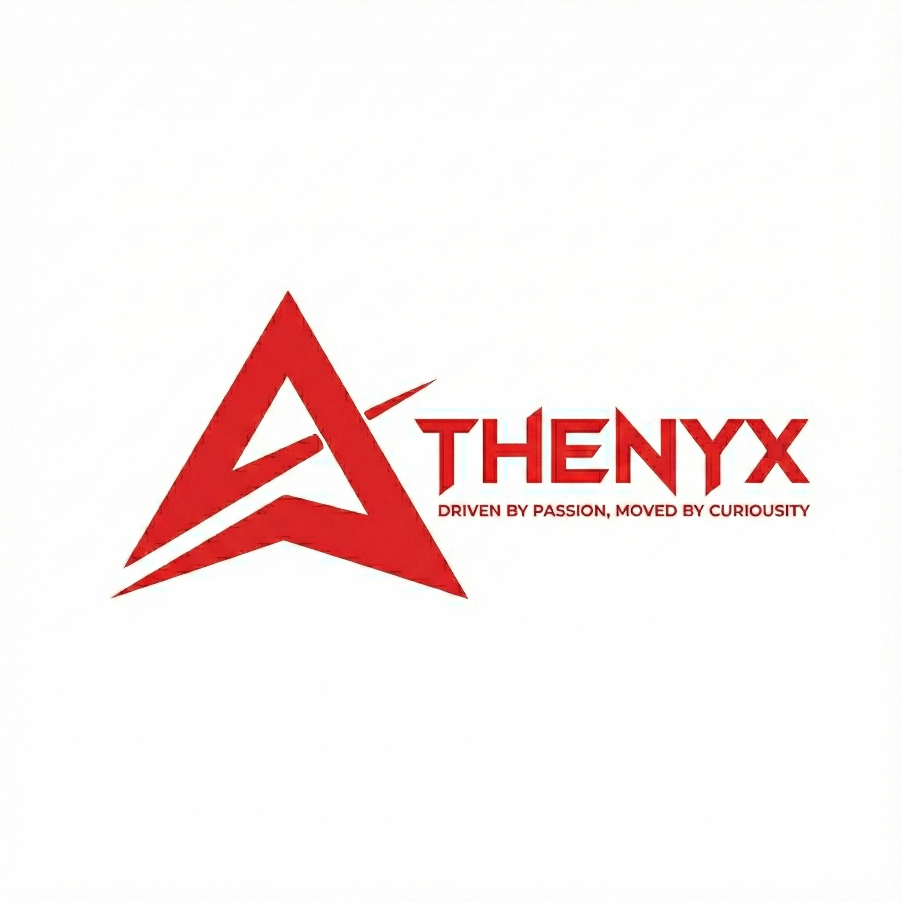

  
  <h1>Athenyx</h1>
  <h3>Seamless Solutions, Limitless Possibilities.</h3>
  

    Athenyx is a dynamic startup based in the Philippines, committed to empowering businesses with robust digital infrastructure and innovative artificial intelligence solutions. We aim to support local independencies with reliable hosting while bridging the gap to the future through advanced outsourcing services.
  

 

  <h2>Our Services</h2>
  <table>
    <tr>
      <td align="center" width="33%">
        <h3>🚀 Hosting Solutions</h3>
        
Secure, high-performance hosting tailored for local enterprises and independencies. Ensuring your digital presence is robust, accessible, and scalable.

      </td>
      <td align="center" width="33%">
        <h3>🤖 Outsourcing Artificial Solutions</h3>
        
Leveraging AI to streamline operations. From automation to intelligent data analysis, driving efficiency and growth.

      </td>
      <td align="center" width="33%">
        <h3>🔮 Future Innovations</h3>
        
Continuously expanding our portfolio, striving to bring more cutting-edge products and services to the market.

      </td>
    </tr>
  </table>

 

  <h2>Leadership Team</h2>
  
Meet the visionaries behind Athenyx:

  <table>
    <tr>
      <td align="center" width="50%">
         
         
        <strong>Boris Gamaliel Duque</strong> 
        Chief Information Security & Cloud Engineer 
         
        Spearheading our security infrastructure and cloud architecture to ensure data integrity and system resilience.
      </td>
      <td align="center" width="50%">
         
         
        <strong>Edward Angel Lorica</strong> 
        Chief Technology Officer (CTO) | People & Ops 
         
        Leading technological strategy while overseeing People and Payroll operations. A dual focus on technical excellence and organizational efficiency.
      </td>
    </tr>
    <tr>
      <td align="center" width="50%">
         
         
        <strong>Jaime Dy III</strong> 
        Chief Technology Officer (CTO) | Assets & Architecture 
         
        Architecting our internal systems and managing assets to create a strong, scalable technical foundation for the company.
      </td>
      <td align="center" width="50%">
         
         
        <strong>Renard B. Macorol</strong> 
        Chief Technology Officer (CTO) | Assets & Architecture 
         
        Architecting our internal systems and managing assets to create a strong, scalable technical foundation for the company.
      </td>
    </tr>
    <tr>
      <td align="center" width="50%">
         
         
        <strong>Leo Rentazida</strong> 
        Chief Information Security Officer 
         
        As Chief Information Security Officer, Leo acts as the guardian of our digital fortress. He is dedicated to securing sensitive data, implementing robust cybersecurity frameworks, and ensuring strict adherence to global compliance standards in an ever-evolving security landscape.
      </td>
      <td align="center" width="50%">
      </td>
    </tr>
  </table>

